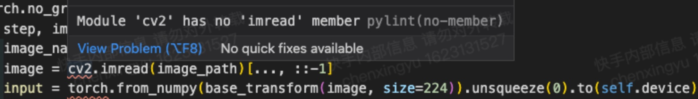
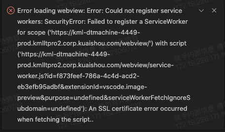

# 常见的问题

## 主页面的 Open folder 失效

**亲测更新到 code-server 3.10.2 之后，Open folder 能用。应该是之前 3.10.0 版本问题。**
更新 code-server 请参考 [install_code_server_and_plugins.sh](./install_code_server_and_plugins.sh)。

## 关于 vscode 的配置文件

一般分为俩个，一个是针对项目的，为 `.vscode/settings.json`；一个是针对 user 的，为 `$HOME/.local/share/core-server/User/settings.json`。通用的如主题一般在后者配置，项目特定相关的在前者配置。

## pylint

**问题：** pylint 对 torch, cv2, numpy 这些库报错，如

<p align="center">
    
</p>

**方案：** 在用户或者针对项目 settings.json 中添加如下配置即可：

```json
"python.linting.pylintArgs": [
        "--errors-only",
        "--generated-members=numpy.* ,torch.* ,cv2.* , cv.*"
]
```

**问题：** import 上级目录的包 pylint 报错


**方案：** 可以额外将 module 的目录添加到 sys.path 里面：

```json
"python.linting.pylintArgs": [
    "--errors-only",
    "--generated-members=numpy.* ,torch.* ,cv2.* ,cv.*",
    "--init-hook",
    "import sys; sys.path.append('PATH/TO/YOUR/MODULE')",
]
```

## SSL 报错

<p align="center">
    
</p>

**方案1：** 在本地运行加 sudo，参考 [issue#4](https://git.corp.kuaishou.com/guojianzhu/kml-vscode/-/issues/4)。

**方案2 (Windows)：** 使用 [Chrome Dev](https://developer.chrome.com/) 版本浏览器。地址栏输入 `chrome://flags/` ，搜索 localhost，在 `Allow invalid certificates for resources loaded from localhost.` 一项，设置为 `Enabled`。随后重启服务端和客户端，稍等一段时间再使用bat脚本即可（注意修改 Chrome 路径为 Dev/Beta 版本）。 （2023.3.29 亲测可用 by @zhengmingwu）


## rg 进程频繁扫描 Ceph 目录

**方案：** 在本地 `.vscode/settings.json` 或系统 settings.json 中添加

```json
"files.exclude": {
    "**/node_modules": true // node_modules 示例，可以 exclude 非项目想的目录，如 /xxx_dir
},
```