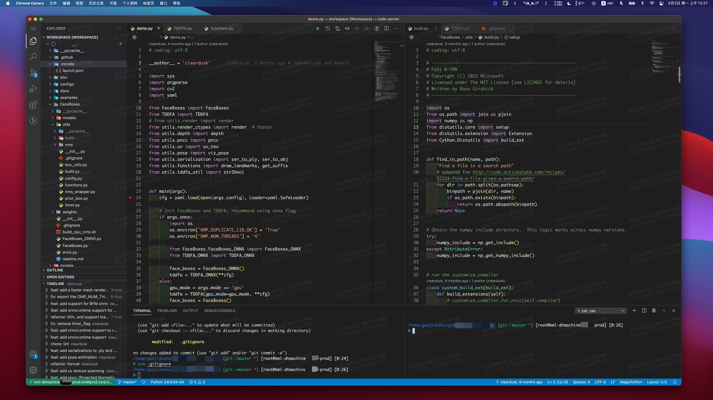

# 在 KML 上使用 VSCode

**💖 若本项目对您的工作效率有提升，欢迎推广或给予 credit ，您的支持是更新的最大动力 💖**

**\[Updates\]**
 - **`2023.07.10`**: 同步更新到 v4.14.1 最新版。
 - **`2023.06.22`**: 同步更新到 v4.14.0 最新版。
 - **`2023.06.07`**: 同步更新到 v4.13.0 最新版。（该版本jupyter，查看图片**无问题**）
 - **`2023.04.26`**: 修复 centOS 安装 code-server 问题 by@袁泰凌。
 - **`2023.04.22`**: 同步更新到 v4.12.0 最新版（据反馈，该版本可能无法查看图片，以及使用jupyter，建议用 v4.11.0，可以修改[这里](https://git.corp.kuaishou.com/guojianzhu/kml-vscode/-/blob/master/install_code_server_and_plugins.sh#L17)。
 - **`2023.03.28`**: 同步更新到 v4.11.0 最新版。添加 `copilot`, `copilot-labs`, `cursor` 等 vsix 插件在 `extensions/` 目录，可自选安装。
 - **`2023.03.07`**: 添加`ChatGPT中文版`插件，安装命令：`code-server --install-extension extensions/WhenSunset.chatgpt-china-5.0.3.vsix`。
 - **`2023.02.27`**: 同步更新到 v4.10.0 最新版。
 - **`2022.12.27`**: 同步更新到 v4.9.1 最新版。
 - **`2022.11.04`**: 同步更新到 v4.8.2 最新版。<strong><font color='red'>该版本支持看视频和音频！</font></strong>
 - **`2022.09.16`**: 同步更新到 v4.7.0 最新版。<strong><font color='red'>该版本经测试很稳定，暂时未出现 reconnect</font></strong>
 - **`2022.07.25`**: 同步更新到 v4.5.1 最新版。<strong><font color='red'>该版本可能会出现频繁 reconnect，建议切到 v4.4.0 版本</font></strong>
 - **`2022.05.13`**: 同步更新到 v4.4.0 最新版。
 - **`2022.04.27`**: 同步更新到 v4.3.0 最新版。
 - **`2022.03.29`**: 同步更新到 v4.2.0 最新版。
 - **`2022.03.08`**: 同步更新到 v4.1.0 最新版。
 - **`2022.02.18`**: 同步更新到 v4.0.2 最新版。
 - **`2022.01.14`**: 更新 [Windows 启动脚本](./run_code_client_windows.bat)，使用 Chrome beta 浏览器。
 - **`2022.01.06`**: code-server 更新到 v4.0.1 最新版，打开图片和 notebook **非常丝滑**，且支持 **macOS** 和 **Windows**，推荐使用 **Chrome beta** 浏览器！

## 前言

作为刚入职的新人，在得知大家在服务器（KML）端大多用 Vim 写代码的时候，本人的内心是有点「崩溃」的。本人仅在修改配置文件或者修改极少量代码的时候选择 Vim，绝大多数情况使用的是 VSCode 或者 JetBrains 系列的 IDE。幸好，在同事的启发下，在前后折腾了两三天之后，终于能使用 VSCode 在服务器（KML）端「愉快」地 coding 了，也不受系统版本的限制。

在搭建完成之后，才发现之前内网 GitLab 上有人分享类似的[教程](https://git.corp.kuaishou.com/laizeqiang/kml-tips/-/blob/master/kml-vscode.md)，本教程更像是对此的进一步的补充，支持最新版本的 VSCode server，其原理一致。遗憾的是，在之前的教程发布的时候，针对的是 KML v1 版本，当时还开放了三个端口，分别为 Jupyter（8888）、Visdom（8097）、TensorBoard（6006），<strong><strike><font color='red'>KML v2 版本仅开放 8888 端口</font></strike></strong>（当前的 kml 支持多开端口），默认为 Jupyter Notebook 服务占用。（经提醒，有的 kml 默认开启端口不是 8888，可以查看下 jupyter 默认启动的端口号，然后将 8888 替换为该端口）

当然，code server 版本也有一些``小坑``，[这里](./note.md)会逐步记录一些常见的问题，比如**查看图片或 jupyter notebook 出现 SSL 的问题**。也欢迎大家能够一起去完善 vscode 的体验 : )  觉得不错的话欢迎推广给身边的小伙伴们，以及 star 支持一下 ~~

## 懒人版

```
# 以 Ubuntu 为例，其它系统版本稍微修改脚本即可

# clone repo
git clone https://git.corp.kuaishou.com/guojianzhu/kml-vscode.git
cd kml-vscode 

# 在 KML 服务器端
# 安装 v4.14.1 版 code server 以及一些推荐的插件（v4.14.1 亲测很丝滑） 
# 默认密码为   ,.Kwai666iawK.,
# 不建议使用默认密码，请在 install_code_server_and_plugins.sh 里面进行修改！
./install_code_server_and_plugins.sh

apt-get install lsof -y # 若无，需要先安装 lsof
./run_code_server.sh # kill 8888 端口对应的服务，并在 8888 端口启动 code server

# 在客户端：macOS
./run_code_client.sh ${你的 kml 地址} #（地址通过点击 kml 页面的 juputer 来复制，多端口点击右边的三个点展开）

# Windows
# 打开 run_code_client_windows.bat 设置 kml 链接，然后双击！

```

**注意**：

* 经测试，python、cpp、jupyter 插件需要通过 vsix 安装，安装脚本已经处理了这种情况
<!-- ```
code-server --install-extension extensions/jupyter-2021.6.999230701_for_code_server_v3.11.vsix
``` -->

## 详细教程

**1. kill 掉默认启动的占用 8888 端口的 Jupyter 服务**
```
lsof | grep 8888  # 查看进程 id
kill -9 $process_id$  # kill 掉对应的进程 id
```

**_额外说明_**：

* 若想要重启 Jupyter 服务，如下：
```
jupyter notebook --ip=0.0.0.0 --port=8888 --allow-root --no-browser
```

* 如果不想使用 VSCode，这里推荐用功能更丰富 Jupyter Lab 来代替 Jupyter Notebook：
```
pip3 install jupyterlab # 安装 Jupyter Lab
jupyter lab /root --ip=0.0.0.0 --port=8888 --allow-root --no-browser # 启动 Jupyter Lab
```

**2. 安装 code server（即 VSCode Server 端）并启动服务**

一键安装最新版 code server 以及推荐的一些插件，以 Ubuntu 为例：
```
./install_code_server_and_plugins.sh 

# 或者
bash install_code_server_and_plugins.sh # 不要用 sh
```

其它发行版（包括 Ubuntu）可以参考 @程墨 提供的：
```
curl -fsSL https://code-server.dev/install.sh | sh -s -- --dry-run
```
一键安装最新版 code server，然后只运行下 `install_code_server_and_plugins.sh` 中安装插件的内容即可。

更多 code server 的发行版参考 [code-server-release](https://github.com/cdr/code-server/releases)

详细过程：
```
# 以 Ubuntu 为例

# 使用代理
export http_proxy=http://oversea-squid2.ko.txyun:11080 https_proxy=http://oversea-squid2.ko.txyun:11080 no_proxy=localhost,127.0.0.1,localaddress,localdomain.com,internal,corp.kuaishou.com,test.gifshow.com,staging.kuaishou.com

# 获取当前最新版（当前为 4.10.0）
VERSION=`wget -qO- -t1 -T2 "https://api.github.com/repos/cdr/code-server/releases/latest" | grep "tag_name" | head -n 1 | awk -F ":" '{print $2}' | sed 's/\"//g;s/,//g;s/ //g'`
VERSION="${VERSION:1}"

# 下载 deb 包或者其它系统对应的安装文件
wget -c https://github.com/cdr/code-server/releases/download/v${VERSION}/code-server_${VERSION}_amd64.deb

# 或下载可执行文件
# wget -c https://github.com/cdr/code-server/releases/download/v${VERSION}/code-server-${VERSION}-linux-amd64.tar.gz

# 这里以 deb 包为例，安装
dpkg -i code-server_${VERSION}_amd64.deb

# 运行 code server
export PASSWORD='******' # 设置你自己的密码
code-server --port 8888 --auth password --bind-addr 0.0.0.0  # 一定要将 --bind-addr 设置为 0.0.0.0，接受所有的 IPv4 地址，否则客户端无法访问 LoL
```

**_额外说明_**：

* 建议 Jupyter Notebook / Lab 或 code-server 服务使用 nohup 或者在 tmux 后台启动。
* 若客户端经常发生重连（reconnet），可以在运行 code server 服务时添加代理，如海外代理：`export http_proxy=http://oversea-squid4.sgp.txyun:11080 https_proxy=http://oversea-squid4.sgp.txyun:11080`，腾讯云代理：`export http_proxy=http://10.72.6.229:11080 https_proxy=http://10.72.6.229:11080` 等。


**3. 客户端/本地访问**

用 Chrome 浏览器打开开发机的 `Jupyter` 链接，链接格式如`http://kml-dtmachine-$KML_ID$-prod.kmlltpro2.corp.kuaishou.com`，KML_ID 为个人的开发机 ID，打开之后便是 VSCode 页面了，完成！

---

**4. 优化体验**

到这里结束了麽？并没有。本地浏览器打开 VSCode，还是以标签的形式存在，VSCode 会存在诸多的快捷键与浏览器冲突，比如 ⌘⇧N 在 Chrome 中是打开无痕模式（相信大家常用 🐶），在 VSCode 默认是打开新的窗口。为了进一步提升体验，可以使用 Chrome 的 PWA（Progressive Web Apps）模式（感兴趣的可以查阅相关的资料），遗憾的是，`Jupyter` 链接只支持 http，不支持 https，Chrome 默认不支持对 http 进行 PWA 封装。没关系，强行启动即可：
```
# 以 macOS 上的 Chrome 浏览器为例
/Applications/Google\ Chrome.app/Contents/MacOS/Google\ Chrome --app=http://kml-dtmachine-$KML_ID$-prod.kmlltpro2.corp.kuaishou.com # 此链接为示范链接，具体请复制个人 KML 开发机上的 `Jupyter` 链接
```
以 PWA 格式启动之后，就「基本」不会存在 VSCode 跟 Chrome 浏览器快捷键的冲突了（实测中在 VSCode 中使用 Jupyter 时，control+s 会与浏览器快捷键冲突，其它暂时未发现），完成！

到这里就结束了麽？还有一个小问题，本人重度依赖 Chrome 浏览器，VSCode 会单独占一个窗口，正常使用 Chrome 浏览器查阅资料会开另一个窗口，这样容易导致混淆，最好的方式是对 Chrome 进行双开，但貌似并没有现成的机制（直接拷贝 Google Chrome.app 重命名？）。解决办法很简单，下载一个开发版 Chrome，即 Chrome Canary（中文为金丝雀）即可。启动的时候脚本替换成如下即可：
```
/Applications/Google\ Chrome\ Canary.app/Contents/MacOS/Google\ Chrome\ Canary --app=https://kml-dtmachine-$KML_ID$-prod.kmlltpro2.corp.kuaishou.com
```

到这里似乎完成得差不多了。建议把服务端启动脚本和客户端启动脚本添加到 PATH 里，就可以两键运行了。VSCode server 中的插件基本与 VSCode 保持一致，用户可以根据自己的需求尽情安装对应的插件了。

以打开一个开源项目为例，最终的效果如下：

<p align="center">
    
</p>

## VSCode 插件

VSCode server 端跟 VSCode（客户端）的体验是差不多的。这里推荐一些不错的插件：

* Python 插件，安装完应该就可以就支持调试、解析跳转等操作
```
# 这是在服务器（KML）上通过命令行安装的方式，也可以在 VSCode 界面安装，如果报错还可通过下载 `.vsix` 的格式继续安装
code-server --install-extension ms-python.python
```
* Bracket Pair Colorizer
* Git History
* GitLens
* indent-rainbow
* Jupyter（强力推荐）
* vscode-icons
* Better Comments
* C/C++
* CMake Tools
* Polacode（代码截图）

还有很多其它优秀的插件，比如 LaTeX Workshop，配置好基本可以替代商业软件 Texpad 了。

## 写在最后
VSCode 作为后起之秀，更受本人青睐。希望本教程能给同学们多一个选择。VSCode 相比 Vim 有不少优势（比如可以直接打开图片、直接使用 VSCode Jupyter 模式方便可视化中间结果、拖拽上传文件、直接在 KML 上调试使用 GPU 的训练代码），但 Vim + Jupyter Lab 也不乏为一个好的选择。VScode 也有一些劣势，比如内存占用较大（服务器端其实无所谓啦），会增加客户端的渲染负担，上传或打开超大的文件容易崩溃等。本文就不对这些做详细分析，诸君选择自己青睐的工具即可。若有一些配置上的问题，或者更好的优化 VSCode 的方法，欢迎与本人讨论 :)

## FAQ

1. **如何上传文件？**
  
    小文件，比如文本，代码，图像等，直接拖到 vscode 的左边目录树即可，但 vscode 的设定是：拖动过去立即打开，所以不适合大文件。大文件建议额外申请个 CPU 的 KML，用 Jupyter 或者 Jupyter Lab 去上传，相对稳定。

2. **快捷键冲突？**

    首先，强烈推荐使用 chrome 浏览器的 app 模式启动，这样能避免几乎所有的快捷键冲突。若还出现快捷键冲突，可能是 vscode 快捷键设置冲突，在设置里面修改下冲突即可。

3. **修改密码？**

    在启动过程中是无法修改密码的，可以先修改 [`run_code_server.sh`](./run_code_server.sh) 的 `PASSWORD` 字段，然后运行该脚本即可。

## 致谢
感谢在配置环境中，同学们给予的启发、帮助与反馈！
